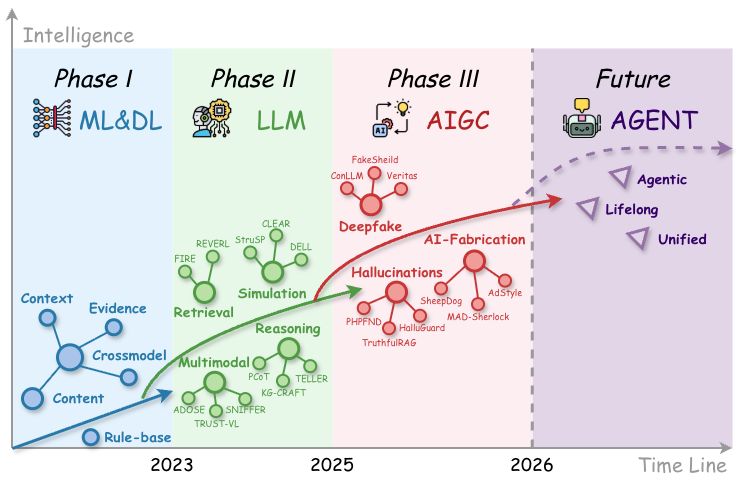

<h1 id="awesome-misinformation-detection-in-the-aigc-era" align="center">Awesome Misinformation Detection in the AIGC Era</h1>

<p align="center">
  <a href="https://arxiv.org/abs/XXXX.XXXXX"></a>
  <a href="https://github.com/zeng-yirong/Awesome_Misinformation_Detection/stargazers"></a>
  <a href="https://github.com/zeng-yirong/Awesome_Misinformation_Detection/network/members"></a>
  <a href="https://github.com/zeng-yirong/Awesome_Misinformation_Detection/issues"></a>
</p>

<p align="center">
  
  
  
  
</p>

<p align="center">
  This is the official repository for the survey paper:<br>
  <strong><a href="https://arxiv.org/abs/XXXX.XXXXX">The Three-Phase Evolution of Misinformation Detection in the AIGC Era: A Survey</a></strong> (HIT-SCIR).
</p>

We maintain a structured reading list of method and system papers cited in the survey, tracing misinformation detection (MID) from pre-LLM data-driven methods to LLM-augmented verification and AIGC-era challenges. Within each subsection, papers are sorted by publication year in ascending order and alphabetically by original title within the same year. Formal conference or journal versions are used whenever confirmed; entries are labeled arXiv only when no formal version was found. Surveys, audits, and purely analytical studies are excluded, while datasets and evaluation resources discussed in the survey are collected separately under Benchmark.

---

<h2 id="introduction">🌟 Introduction</h2>

Misinformation detection (MID) is being reshaped by the rapid development of AI-generated content (AIGC). Large language models (LLMs) and multi-modal generative models play a dual role: they strengthen verification through reasoning, retrieval, and multi-modal understanding, while also lowering the cost of producing persuasive false or misleading content.

This survey provides an evolutionary view of MID in the AIGC era. Rather than reviewing isolated tasks or methods, we organize the field into three phases: **Pre-LLM MID**, **LLM-Augmented MID**, and **AIGC-era MID**. We further clarify the conceptual scope of misinformation and MID, review benchmark and evaluation evolution, and outline future directions including agentic verification, lifelong detection, and unified systems.

<p align="center">
  
</p>

<h2 id="contents">📚 Contents</h2>

<details open>
<summary>📚 Contents</summary>

- [Awesome Misinformation Detection in the AIGC Era](#awesome-misinformation-detection-in-the-aigc-era)
  - [🌟 Introduction](#introduction)
  - [📚 Contents](#contents)
  - [🧱 Phase I: Pre-LLM MID](#phase-i-pre-llm-mid)
    - [Content-based MID](#content-based-mid)
    - [Context-based MID](#context-based-mid)
    - [Evidence-based MID](#evidence-based-mid)
    - [Cross-modal MID](#cross-modal-mid)
  - [🤖 Phase II: LLM-Augmented MID](#phase-ii-llm-augmented-mid)
    - [Reasoning](#reasoning)
    - [RAG](#rag)
    - [Simulation](#simulation)
    - [MLLM](#mllm)
  - [✨ Phase III: AIGC-era MID](#phase-iii-aigc-era-mid)
    - [AI-generated Fabrication](#ai-generated-fabrication)
    - [Misinformative Hallucinations](#misinformative-hallucinations)
    - [Multimedia Deepfake](#multimedia-deepfake)
  - [📊 Benchmark](#benchmark)
  - [🚀 Future Direction](#future-direction)
    - [Agentic Verification](#agentic-verification)
    - [Lifelong Detection](#lifelong-detection)
    - [Unified System](#unified-system)
  - [✍️ Citation](#citation)

</details>

---

<h2 id="phase-i-pre-llm-mid">🧱 Phase I: Pre-LLM MID</h2>

Pre-LLM MID mainly targets human-authored misinformation and learns detection signals from content, social context, external evidence, and cross-modal consistency.

<h3 id="content-based-mid">Content-based MID</h3>

- **A Stylometric Inquiry into Hyperpartisan and Fake News**. ACL, 2018. [[paper](https://aclanthology.org/P18-1022/)]
- **Automatic Detection of Fake News**. COLING, 2018. [[paper](https://aclanthology.org/C18-1287/)]
- **LUX (Linguistic Aspects Under Examination): Discourse Analysis for Automatic Fake News Classification**. ACL-IJCNLP, 2021. [[paper](https://aclanthology.org/2021.findings-acl.4/)]
- **Linguistic Features Based Framework for Automatic Fake News Detection**. Computers & Industrial Engineering, 2022. [[paper](https://www.sciencedirect.com/science/article/pii/S0360835222004697)]
- **Bridging Thoughts and Words: Graph-Based Intent-Semantic Joint Learning for Fake News Detection**. CIKM, 2025. [[paper](https://dl.acm.org/doi/abs/10.1145/3746252.3761400)]
- **Demystifying Neural Fake New via Linguistic Feature-based Interpretation** [[paper](https://aclanthology.org/2022.coling-1.573)]


<h3 id="context-based-mid">Context-based MID</h3>

- **Beyond News Contents: The Role of Social Context for Fake News Detection**. WSDM, 2019. [[paper](https://dl.acm.org/doi/abs/10.1145/3289600.3290994)]
- **Rumor Detection on Social Media with Bi-Directional Graph Convolutional Networks**. AAAI, 2020. [[paper](https://ojs.aaai.org/index.php/AAAI/article/view/5393)]
- **Social Bots Detection via Fusing BERT and Graph Convolutional Networks**. Symmetry, 2021. [[paper](http://www.mdpi.com/2073-8994/14/1/30)]
- **Fake News Detection Based on News Content and Social Contexts: A Transformer-Based Approach**. International Journal of Data Science and Analytics, 2022. [[paper](https://doi.org/10.1007/s41060-021-00302-z)]
- **Zoom Out and Observe: News Environment Perception for Fake News Detection**. ACL, 2022. [[paper](https://aclanthology.org/2022.acl-long.311/)]
- **Detecting Social Media Manipulation in Low-Resource Languages**. WWW Companion, 2023. [[paper](https://dl.acm.org/doi/abs/10.1145/3543873.3587615)]
- **A Macro-and Micro-Hierarchical Transfer Learning Framework for Cross-Domain Fake News Detection**. WWW, 2025. [[paper](https://dl.acm.org/doi/abs/10.1145/3696410.3714517)]
- **Unseen Fake News Detection Through Causal Debiasing**. WWW Companion, 2025. [[paper](https://dl.acm.org/doi/abs/10.1145/3701716.3715517)]
- **Variety Is the Spice of Life: Detecting Misinformation with Dynamic Environmental Representations**. CIKM, 2025. [[paper](https://dl.acm.org/doi/abs/10.1145/3746252.3761114)]

<h3 id="evidence-based-mid">Evidence-based MID</h3>

- **ClaimBuster: The First-ever End-to-end Fact-checking System**. VLDB, 2017. [[paper](https://ranger.uta.edu/~cli/pubs/2017/claimbuster-vldb17demo-hassan.pdf)]
- **Compare to the Knowledge: Graph Neural Fake News Detection with External Knowledge**. ACL-IJCNLP, 2021. [[paper](https://aclanthology.org/2021.acl-long.62/)]
- **FACE-KEG: Fact Checking Explained Using Knowledge Graphs**. WSDM, 2021. [[paper](https://dl.acm.org/doi/abs/10.1145/3437963.3441828)]
- **Incorporating Relational Knowledge in Explainable Fake News Detection**. PAKDD, 2021. [[paper](https://link.springer.com/chapter/10.1007/978-3-030-75768-7_32)]
- **KAN: Knowledge-Aware Attention Network for Fake News Detection**. AAAI, 2021. [[paper](https://ojs.aaai.org/index.php/AAAI/article/view/16080)]
- **Claim-Dissector: An Interpretable Fact-Checking System with Joint Re-ranking and Veracity Prediction**. ACL, 2023. [[paper](https://aclanthology.org/2023.findings-acl.647/)]
- **Generating Literal and Implied Subquestions to Fact-check Complex Claims**. EMNLP, 2022. [[paper](https://aclanthology.org/2022.emnlp-main.229/)]
- **Towards Fine-Grained Reasoning for Fake News Detection**. AAAI, 2022. [[paper](https://ojs.aaai.org/index.php/AAAI/article/view/20517)]
- **FactKG: Fact Verification via Reasoning on Knowledge Graphs**. ACL, 2023. [[paper](https://aclanthology.org/2023.acl-long.895/)]
- **Fact or Fiction? Improving Fact Verification with Knowledge Graphs through Simplified Subgraph Retrievals**. FEVER, 2024. [[paper](https://aclanthology.org/2024.fever-1.32/)]

<h3 id="cross-modal-mid">Cross-modal MID</h3>

- **Detecting Deep-Fake Videos from Phoneme-Viseme Mismatches**. CVPR Workshops, 2020. [[paper](https://openaccess.thecvf.com/content_CVPRW_2020/html/w39/Agarwal_Detecting_Deep-Fake_Videos_From_Phoneme-Viseme_Mismatches_CVPRW_2020_paper.html)]
- **Not Made for Each Other: Audio-Visual Dissonance-Based Deepfake Detection and Localization**. ACM MM, 2020. [[paper](https://dl.acm.org/doi/abs/10.1145/3394171.3413700)]
- **Hierarchical Multi-Modal Contextual Attention Network for Fake News Detection**. SIGIR, 2021. [[paper](https://dl.acm.org/doi/abs/10.1145/3404835.3462871)]
- **InfoSurgeon: Cross-Media Fine-Grained Information Consistency Checking for Fake News Detection**. ACL-IJCNLP, 2021. [[paper](https://aclanthology.org/2021.acl-long.133/)]

---

<h2 id="phase-ii-llm-augmented-mid">🤖 Phase II: LLM-Augmented MID</h2>

LLMs augment existing MID pipelines through reasoning, retrieval, context reconstruction, and multi-modal understanding.

<h3 id="reasoning">Reasoning</h3>

- **Bad Actor, Good Advisor: Exploring the Role of Large Language Models in Fake News Detection**. AAAI, 2024. [[paper](https://ojs.aaai.org/index.php/AAAI/article/view/30214)]
- **Large Language Model Agent for Fake News Detection**. IEEE, 2024. [[paper](https://ieeexplore.ieee.org/abstract/document/10826000)]
- **TELLER: A Trustworthy Framework for Explainable, Generalizable and Controllable Fake News Detection**. Findings of ACL, 2024. [[paper](https://aclanthology.org/2024.findings-acl.919/)]
- **PCoT: Persuasion-Augmented Chain of Thought for Detecting Fake News and Social Media Disinformation**. ACL, 2025. [[paper](https://aclanthology.org/2025.acl-long.1215/)]
- **The truth becomes clearer through debate! Multi-agent systems with large language models unmask fake news**. SIGIR, 2025. [[paper](https://dlnext.acm.org/doi/pdf/10.1145/3726302.3730092)]
- **Towards Real-Time Fake News Detection under Evidence Scarcity**. arXiv, 2025. [[paper](https://arxiv.org/abs/2510.11277)]
- **A Graph-Enhanced Defense Framework for Explainable Fake News Detection with LLM**. ACM TOIS, 2026. [[paper](https://dl.acm.org/doi/10.1145/3810244)]
- **Are LLMs Enough for Hyperpartisan, Fake, Polarized and Harmful Content Detection? Evaluating In-Context Learning vs. Fine-Tuning**. ICWSM, 2026. [[paper](https://ojs.aaai.org/index.php/ICWSM/article/view/42712)]
- **FactGuard: Event-Centric and Commonsense-Guided Fake News Detection**. AAAI, 2026. [[paper](https://ojs.aaai.org/index.php/AAAI/article/view/36998)]
- **KG-CRAFT: Knowledge Graph-based Contrastive Reasoning with LLMs for Enhancing Automated Fact-checking**. EACL, 2026. [[paper](https://aclanthology.org/2026.eacl-long.302/)]
- **Reasoning About the Unsaid: Misinformation Detection with Omission-Aware Graph Inference**. AAAI, 2026. [[paper](https://ojs.aaai.org/index.php/AAAI/article/view/37097)]

<h3 id="rag">RAG</h3>

- **Check Your Facts and Try Again: Improving Large Language Models with External Knowledge and Automated Feedback**. arXiv, 2023. [[paper](https://arxiv.org/abs/2302.12813)]
- **FactLLaMA: Optimizing Instruction-Following Language Models with External Knowledge for Automated Fact-Checking**. APSIPA ASC, 2023. [[paper](https://ieeexplore.ieee.org/abstract/document/10317251)]
- **VeraCT Scan: Retrieval-Augmented Fake News Detection with Justifiable Reasoning**. ACL Demo, 2024. [[paper](https://aclanthology.org/2024.acl-demos.25/)]
- **+ VeriRel: Verification Feedback to Enhance Document Retrieval for Scientific Fact Checking**. CIKM, 2025. [[paper](https://dl.acm.org/doi/abs/10.1145/3746252.3760822)]
- **A Dynamic Knowledge Update-Driven Model with Large Language Models for Fake News Detection**. arXiv, 2025. [[paper](https://arxiv.org/abs/2509.11687)]
- **FIRE: Fact-Checking with Iterative Retrieval and Verification**. Findings of NAACL, 2025. [[paper](https://aclanthology.org/2025.findings-naacl.158/)]
- **HiEAG: Evidence-Augmented Generation for Out-of-Context Misinformation Detection**. arXiv, 2025. [[paper](https://arxiv.org/abs/2511.14027)]
- **When Retrieval Outperforms Generation: Dense Evidence Retrieval for Scalable Fake News Detection**. LDK, 2025. [[paper](https://aclanthology.org/2025.ldk-1.26/)]
- **ZoFia: Zero-Shot Fake News Detection with Entity-Guided Retrieval and Multi-LLM Interaction**. arXiv, 2025. [[paper](https://arxiv.org/abs/2511.01188)]
- **REVEAL: Retrieval-Enhanced Verification for Multimodal Fact-Checking**. FEVER, 2026. [[paper](https://aclanthology.org/2026.fever-1.8/)]
- **User-Centric Evidence Ranking for Attribution and Fact Verification**. EACL, 2026. [[paper](https://aclanthology.org/2026.eacl-long.340/)]

<h3 id="simulation">Simulation</h3>

- **DELL: Generating Reactions and Explanations for LLM-Based Misinformation Detection**. ACL, 2024. [[paper](https://aclanthology.org/2024.findings-acl.155/)]
- **Let Silence Speak: Enhancing Fake News Detection with Generated Comments from Large Language Models**. CIKM, 2024. [[paper](https://dl.acm.org/doi/abs/10.1145/3627673.3679519)]
- **Do not wait: Preemptive rumor detection with cooperative LLMs and accessible social context**. Information Processing & Management, 2025. [[paper](https://doi.org/10.1016/j.ipm.2024.103995)]
- **Exploring Large Language Models for Effective Rumor Detection on Social Media**. NAACL, 2025. [[paper](https://aclanthology.org/2025.naacl-long.128/)]
- **Group-Adaptive Adversarial Learning for Robust Fake News Detection Against Malicious Comments**. arXiv, 2025. [[paper](https://arxiv.org/abs/2510.09712)]
- **MPCG: Multi-Round Persona-Conditioned Generation for Modeling the Evolution of Misinformation with LLMs**. EMNLP, 2025. [[paper](https://aclanthology.org/2025.emnlp-main.1727/)]
- **Simulating Rumor Spreading in Social Networks using LLM Agents**. arXiv, 2025. [[paper](https://arxiv.org/abs/2502.01450)]
- **Structure-aware Propagation Generation with Large Language Models for Fake News Detection**. ACL, 2025. [[paper](https://aclanthology.org/2025.findings-emnlp.714/)]
- **Synergizing LLMs with Global Label Propagation for Multimodal Fake News Detection**. ACL, 2025. [[paper](https://aclanthology.org/2025.acl-long.72/)]
- **CLEAR: Prototype-conditioned Flow Purification for LLM-based Rumor Detection with Dirichlet Evidential Learning**. Information Processing & Management, 2026. [[paper](https://doi.org/10.1016/j.ipm.2026.104887)]

<h3 id="mllm">MLLM</h3>

- **SNIFFER: Multimodal Large Language Model for Explainable Out-of-Context Misinformation Detection**. CVPR, 2024. [[paper](https://openaccess.thecvf.com/content/CVPR2024/html/Qi_SNIFFER_Multimodal_Large_Language_Model_for_Explainable_Out-of-Context_Misinformation_Detection_CVPR_2024_paper.html)]
- **EXCLAIM: An Explainable Cross-Modal Agentic System for Misinformation Detection with Hierarchical Retrieval**. arXiv, 2025. [[paper](https://arxiv.org/abs/2504.06269)]
- **MERIT: Modular Framework for Multimodal Misinformation Detection with Web-Grounded Reasoning**. arXiv, 2025. [[paper](https://arxiv.org/abs/2412.05155)]
- **Multimodal Fact-Checking with Vision Language Models: A Probing Classifier based Solution with Embedding Strategies**. COLING, 2025. [[paper](https://arxiv.org/abs/2412.05155)]
- **TRUST-VL: An Explainable News Assistant for General Multimodal Misinformation Detection**. EMNLP, 2025. [[paper](https://aclanthology.org/2025.emnlp-main.284/)]
- **ADOSE: Active Multi-source Domain Adaptation for Multimodal Fake News Detection**. AAAI, 2026. [[paper](https://ojs.aaai.org/index.php/AAAI/article/view/39125)]
- **RAMA: Retrieval-Augmented Multi-Agent Framework for Misinformation Detection in Multimodal Fact-Checking**. WWW Companion, 2026. [[paper](https://doi.org/10.1145/3774905.3796483)]
- **T^2Agent A Tool-augmented Multimodal Misinformation Detection Agent with Monte Carlo Tree Search**. AAAI, 2026. [[paper](https://ojs.aaai.org/index.php/AAAI/article/view/36977)]
- **Toward Multimodal Fake News Detection by Multi-perspective Rationale Generation and Verification**. AAAI, 2026. [[paper](https://ojs.aaai.org/index.php/AAAI/article/view/36965)]

---

<h2 id="phase-iii-aigc-era-mid">✨ Phase III: AIGC-era MID</h2>

AIGC-era MID focuses on detection targets introduced or amplified by generative AI: AI-generated fabrications, deepfakes, and hallucinations.

<h3 id="ai-generated-fabrication">AI-generated Fabrication</h3>

- **Fake News in Sheep's Clothing: Robust Fake News Detection Against LLM-Empowered Style Attacks**. KDD, 2024. [[paper](https://dl.acm.org/doi/abs/10.1145/3637528.3671977)]
- **Adversarial Style Augmentation via Large Language Model for Robust Fake News Detection**. WWW, 2025. [[paper](https://dl.acm.org/doi/abs/10.1145/3696410.3714569)]
- **Attacking Misinformation Detection Using Adversarial Examples Generated by Language Models**. EMNLP, 2025. [[paper](https://aclanthology.org/2025.emnlp-main.1405/)]
- **Debate-to-Detect: Reformulating Misinformation Detection as a Real-World Debate with Large Language Models**. EMNLP, 2025. [[paper](https://aclanthology.org/2025.emnlp-main.764/)]
- **Kill Two Birds with One Stone: Generalized and Robust AI-Generated Text Detection via Dynamic Perturbations**. NAACL, 2025. [[paper](https://aclanthology.org/2025.naacl-long.446/)]
- **RetrieverGuard: Empowering Information Retrieval to Combat LLM-Generated Misinformation**. Findings of NAACL, 2025. [[paper](https://aclanthology.org/2025.findings-naacl.249/)]
- **Cross-Prompt Generalization in Detecting AI-Generated Fake News Using Interpretable Linguistic Features**. arXiv, 2026. [[paper](https://arxiv.org/abs/2606.04199)]
- **Human vs. Machine Deception: Distinguishing AI-Generated and Human-Written Fake News Using Ensemble Learning**. arXiv, 2026. [[paper](https://arxiv.org/abs/2604.09960)]

<h3 id="misinformative-hallucinations">Misinformative Hallucinations</h3>

- **SelfCheckGPT: Zero-Resource Black-Box Hallucination Detection for Generative Large Language Models**. EMNLP, 2023. [[paper](https://aclanthology.org/2023.emnlp-main.557/)]
- **ReEval: Automatic Hallucination Evaluation for Retrieval-Augmented Large Language Models via Transferable Adversarial Attacks**. Findings of NAACL, 2024. [[paper](https://aclanthology.org/2024.findings-naacl.85/)]
- **Consistency Is the Key: Detecting Hallucinations in LLM Generated Text By Checking Inconsistencies About Key Facts**. arXiv, 2025. [[paper](https://arxiv.org/abs/2511.12236)]
- **HalluciNot: Hallucination Detection Through Context and Common Knowledge Verification**. arXiv, 2025. [[paper](https://iclr.cc/virtual/2026/poster/10007034)]
- **Zero-knowledge LLM hallucination detection and mitigation through fine-grained cross-model consistency**. EMNLP Industry Track, 2025. [[paper](https://aclanthology.org/2025.emnlp-industry.139/)]
- **FactSelfCheck: Fact-Level Black-Box Hallucination Detection for LLMs**. Findings of EACL, 2026. [[paper](https://aclanthology.org/2026.findings-eacl.296/)]
- **Hallucination Begins Where Saliency Drops**. ICLR, 2026. [[paper](https://arxiv.org/abs/2601.20279)]
- **HalluGuard: Demystifying Data-Driven and Reasoning-Driven Hallucinations in LLMs**. ICLR, 2026. [[paper](https://iclr.cc/virtual/2026/poster/10008801)]
- **PHPFND: Detecting Fake News via Post-Hoc Processing of LLMs Hallucination**. AAAI, 2026. [[paper](https://doi.org/10.1609/aaai.v40i1.37050)]
- **The Energy of Falsehood: Detecting Hallucinations via Diffusion Model Likelihoods**. FEVER, 2026. [[paper](https://aclanthology.org/2026.fever-1.4/)]
- **TruthfulRAG: Resolving Factual-level Conflicts in Retrieval-Augmented Generation with Knowledge Graphs**. AAAI, 2026. [[paper](https://doi.org/10.1609/aaai.v40i38.40489)]

<h3 id="multimedia-deepfake">Multimedia Deepfake</h3>

- **BusterX: MLLM-Powered AI-Generated Video Forgery Detection and Explanation**. arXiv, 2025. [[paper](https://arxiv.org/abs/2505.12620)]
- **CAD: A General Multimodal Framework for Video Deepfake Detection via Cross-Modal Alignment and Distillation**. arXiv, 2025. [[paper](https://arxiv.org/abs/2505.15233)]
- **D³: Scaling Up Deepfake Detection by Learning from Discrepancy**. CVPR, 2025. [[paper](https://arxiv.org/abs/2404.04584)]
- **FakeShield: Explainable Image Forgery Detection and Localization via Multi-modal Large Language Models**. ICLR, 2025. [[paper](https://arxiv.org/abs/2410.02761)]
- **Spot the Fake: Large Multimodal Model-Based Synthetic Image Detection with Artifact Explanation**. arXiv, 2025. [[paper](https://arxiv.org/abs/2503.14905)]
- **TruthLens: Explainable DeepFake Detection for Face Manipulated and Fully Synthetic Data**. arXiv, 2025. [[paper](https://arxiv.org/abs/2503.15867)]
- **Investigating Self-Supervised Representations for Audio-Visual Deepfake Detection**. CVPR, 2026. [[paper](https://arxiv.org/abs/2511.17181)]
- **PRPO: Paragraph-level Policy Optimization for Vision-Language Deepfake Detection**. ICML, 2026. [[paper](https://icml.cc/virtual/2026/poster/65679)]
- **Revealing the Truth with ConLLM for Detecting Multi-Modal Deepfakes**. Findings of EACL, 2026. [[paper](https://arxiv.org/abs/2601.17530)]
- **TranX-Adapter: Bridging Artifacts and Semantics within MLLMs for Robust AI-generated Image Detection**. arXiv, 2026. [[paper](https://arxiv.org/abs/2602.21716)]
- **Veritas: Generalizable Deepfake Detection via Pattern-Aware Reasoning**. ICLR, 2026. [[paper](https://iclr.cc/virtual/2026/poster/10011453)]

---

<h2 id="benchmark">📊 Benchmark</h2>

- **FakeNewsNet: A Data Repository with News Content, Social Context and Dynamic Information for Studying Fake News on Social Media**. arXiv, 2018. [[paper](https://arxiv.org/abs/1809.01286)]
- **FEVER: A Large-scale Dataset for Fact Extraction and Verification**. NAACL, 2018. [[paper](https://aclanthology.org/N18-1074/)]
- **Fakeddit: A New Multimodal Benchmark Dataset for Fine-grained Fake News Detection**. LREC, 2020. [[paper](https://arxiv.org/abs/1911.03854)]
- **PubHealthTab: A Public Health Table-based Dataset for Evidence-based Fact Checking**. Findings of NAACL, 2022. [[paper](https://aclanthology.org/2022.findings-naacl.1/)]
- **End-to-End Multimodal Fact-Checking and Explanation Generation: A Challenging Dataset and Models**. SIGIR, 2023. [[paper](https://doi.org/10.1145/3539618.3591879)]
- **FakeSV: A Multimodal Benchmark with Rich Social Context for Fake News Detection on Short Video Platforms**. AAAI, 2023. [[paper](https://arxiv.org/abs/2211.10973)]
- **FineFake: A Knowledge-Enriched Dataset for Fine-Grained Multi-Domain Fake News Detection**. arXiv, 2024. [[paper](https://arxiv.org/abs/2404.01336)]
- **RAGTruth: A Hallucination Corpus for Developing Trustworthy Retrieval-Augmented Language Models**. ACL, 2024. [[paper](https://aclanthology.org/2024.acl-long.585/)]
- **A New Dataset and Benchmark for Grounding Multimodal Misinformation**. ACM MM, 2025. [[paper](https://arxiv.org/abs/2509.08008)]
- **HalluLens: LLM Hallucination Benchmark**. ACL, 2025. [[paper](https://aclanthology.org/2025.acl-long.1176/)]
- **HalluMix: A Task-Agnostic, Multi-Domain Benchmark for Real-World Hallucination Detection**. arXiv, 2025. [[paper](https://arxiv.org/abs/2505.00506)]
- **MFC-Bench: Benchmarking Multimodal Fact-Checking with Large Vision-Language Models**. arXiv, 2025. [[paper](https://arxiv.org/abs/2406.11288)]
- **MMFakeBench: A Mixed-Source Multimodal Misinformation Detection Benchmark for LVLMs**. ICLR, 2025. [[paper](https://arxiv.org/abs/2406.08772)]
- **MMM-Fact: A Multimodal, Multi-Domain Fact-Checking Dataset with Multi-Level Retrieval Difficulty**. arXiv, 2025. [[paper](https://arxiv.org/abs/2510.25120)]
- **VLDBench: Evaluating Multimodal Disinformation with Regulatory Alignment**. Information Fusion, 2025. [[paper](https://arxiv.org/abs/2502.11361)]
- **Worse than Zero-shot? A Fact-Checking Dataset for Evaluating the Robustness of RAG Against Misleading Retrievals**. NeurIPS Datasets and Benchmarks, 2025. [[paper](https://proceedings.neurips.cc/paper_files/paper/2025/hash/ed25c00ff6900989116d3ba5d607d33d-Abstract-Datasets_and_Benchmarks_Track.html)]
- **XFacta: Contemporary, Real-World Dataset and Evaluation for Multimodal Misinformation Detection with Multimodal LLMs**. arXiv, 2025. [[paper](https://arxiv.org/abs/2508.09999)]
- **Drifting Away from Truth: GenAI-Driven News Diversity Challenges LVLM-Based Misinformation Detection**. AAAI, 2026. [[paper](https://arxiv.org/abs/2508.12711)]
- **Omni-Fake: Benchmarking Unified Multimodal Social Media Deepfake Detection**. CVPR, 2026. [[paper](https://arxiv.org/abs/2605.01638)]
- **The Coherence Trap: When MLLM-Crafted Narratives Exploit Manipulated Visual Contexts**. CVPR, 2026. [[paper](https://arxiv.org/abs/2505.17476)]
- **The Synthetic Media Shift: Tracking the Rise, Virality, and Detectability of AI-Generated Multimodal Misinformation**. arXiv, 2026. [[paper](https://arxiv.org/abs/2604.15372)]
- **TriDF: Evaluating Perception, Detection, and Hallucination for Interpretable DeepFake Detection**. CVPR, 2026. [[paper](https://arxiv.org/abs/2512.10652)]

---

<h2 id="future-direction">🚀 Future Direction</h2>

<h3 id="agentic-verification">Agentic Verification</h3>

Develop auditable verification agents that coordinate reasoning, retrieval, tools, and specialized models while preserving traceable evidence and intermediate decisions.

<h3 id="lifelong-detection">Lifelong Detection</h3>

Build continually evolving detectors that retain historical knowledge, adapt to emerging generators and misinformation patterns, and remain calibrated under temporal and domain shifts.

<h3 id="unified-system">Unified System</h3>

Unify content analysis, source assessment, evidence retrieval, propagation modeling, cross-modal consistency, and explanation within a shared veracity-centered system.

---

<h2 id="citation">✍️ Citation</h2>

If you find our survey or this repository useful, please consider citing our work:

```bibtex
@article{zeng202xthree,
  title={The Three-Phase Evolution of Misinformation Detection in the AIGC Era: A Survey},
  author={Zeng, Yirong and Dai, Juyi and Ding, Xiao and Cai, Bibo and You, Shen and Zang, Wenyu and Qin, Bing and Liu, Ting},
  journal={arXiv preprint arXiv:XXXX.XXXXX},
  year={202x}
}
```

---

Maintained by the authors from Harbin Institute of Technology, SCIR.
